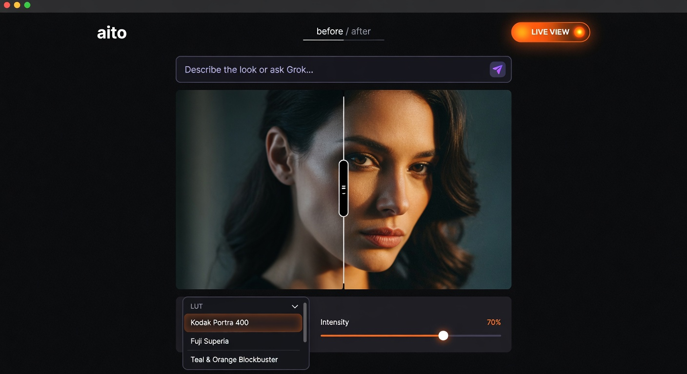
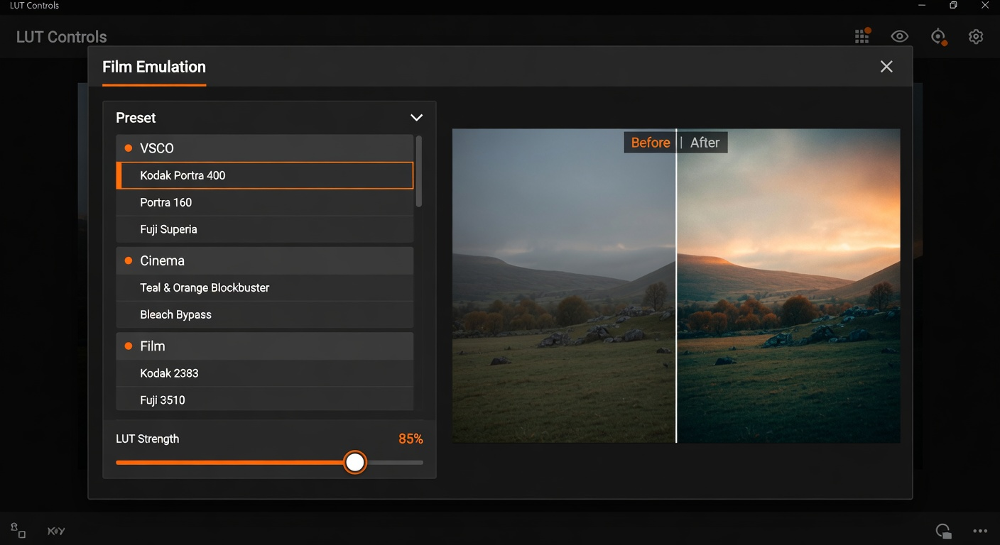
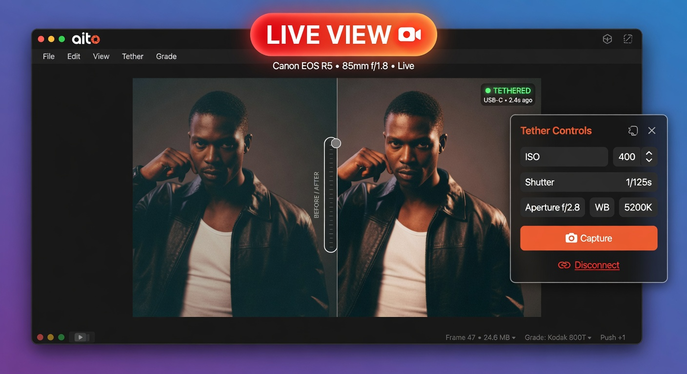
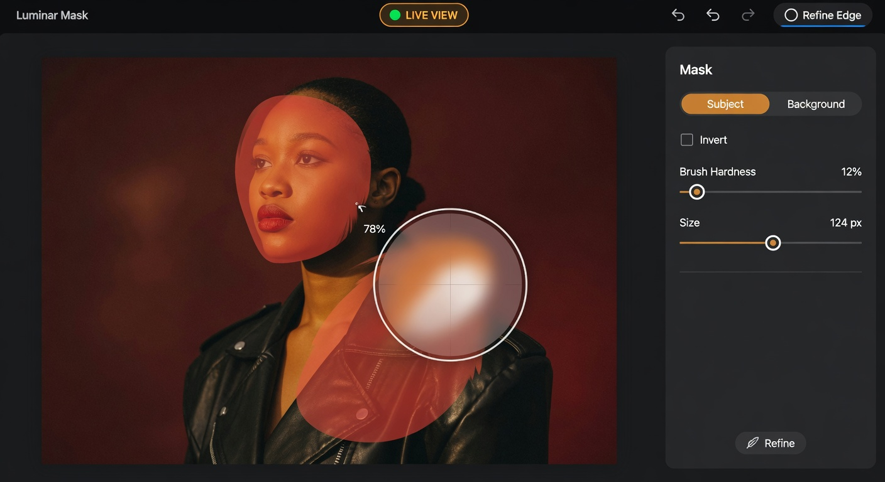

# aito

**AI photo editing for tethered, high-end workflows.**

**Desktop pro. Mobile PWA. One beautiful minimal interface.**

- Real-time Grok commands (adjustments, LUTs, masking)
- Live camera tethering via local companion (Canon, Sony, Phase One, etc.)
- Film-accurate LUTs + custom .cube support
- SAM-powered masked corrections + pressure-sensitive brush
- Hatch export (subject / background / full)
- Works as a beautiful mobile PWA on iPhone and Android

**[Open the editor](https://fornevercollective.github.io/aito/)** — installs as PWA  
**[Hub, iterations & mobile notes](https://fornevercollective.github.io/aito/hub/)**  
**[Brand](https://fornevercollective.github.io/aito/brand/) · [Pricing](https://fornevercollective.github.io/aito/pricing/) · [License](https://fornevercollective.github.io/aito/license/)**

One repo. Two tracks. The editor is the product.

### In action

<table>
<tr>
<td align="center" width="50%">

<br><sub>Main editor — prompt bar + live tethered capture</sub>
</td>
<td align="center" width="50%">

<br><sub>Film emulation LUTs — VSCO, Kodak, Fuji, cinema presets</sub>
</td>
</tr>
<tr>
<td align="center" width="50%">

<br><sub>Live tethering — clickable LIVE VIEW + direct camera controls</sub>
</td>
<td align="center" width="50%">

<br><sub>AI masking + precise brush refinement</sub>
</td>
</tr>
</table>

- **Main track** — Production photo editor (masked corrections, brush, hatch export, WebGL artistic layers).
- **Living Canvas pivot** — High-end research track exploring vwall patterns + cinematic HUD interfaces (Gmunk/Tron/Resolve/VSCO).

See [versions/](./versions) for the research tracks (including the vwall Living Canvas pivot) and the live site for the current product experience.

---

AI-driven image/video retouching app. v0 ships the visual core: a
before/after slider with six AI-controllable WebGL effect layers
(sampling, unfocused, burn, glass, magnifier, crack), wired to a
WebSocket inference channel with a built-in mock so it runs
standalone.

## Mobile PWA

aito is a full Progressive Web App with offline support.

**Install on iOS / Android:**
1. Open https://fornevercollective.github.io/aito/ in Safari or Chrome
2. Tap **Share** → **Add to Home Screen**

Once installed you get:
- Native app-like experience (no browser chrome)
- Offline access to the editor shell
- Fast subsequent launches
- The same powerful features as desktop (AI, tether, brush, LUTs)

On desktop you can also install via the **Install** button that appears in the top bar when your browser supports it.

The Service Worker aggressively caches the UI so the app remains usable even with poor connectivity.

The interface adapts automatically:
- Desktop → powerful 3-column layout with permanent inspector
- Mobile/Tablet → image-first with elegant bottom bar + slide-up sheets

## Run (recommended)

Double-click one of the launchers in the project root (Finder-friendly, matches the blank/stageforge pattern):

- **`Launch.command`** — Opens Terminal, starts the Vite frontend + inference server (mock by default), and opens your browser.
- **`Launch-StageForge.command`** — Starts the full StageForge TUI orchestrator (health/restart loops + the photo editing roadmap as first-class jobs/stages). This is the control center for iterating through all the next steps.

From Terminal you can also run:

```bash
./start.sh                 # full workspace (frontend + mock inference)
./Launch-StageForge.command
```

Or the classic way:

```bash
npm install
npm run dev
```

The app opens at <http://localhost:5173>.

### Server modes

- **Default (mock)**: `./start.sh` runs the synthetic inference cycle so you can develop the UI without a real backend.
- **Real inference** (with or without SAM):

  ```bash
  VITE_AI_WS=ws://localhost:8765 ./start.sh
  # or
  AITO_REAL_SAM=1 ./start.sh     # starts server/inference_ws.py (needs checkpoint for real SAM)
  ```

A minimal Python WS mock lives in `server/mock_ws.py` (also exposed as `npm run mock:server`).

For the full SAM + server experience see `HANDOFF.md`.

## Architecture

```
src/
  ai/
    channel.ts      WebSocket client + automatic mock fallback
    mapper.ts       AI signal → per-effect uniform overrides
  effects/
    types.ts        Typed props for every effect kind
    presets.ts      Neutral default uniforms
    shaders/        Six GLSL effects + a common snippet library
  components/
    BeforeAfter.tsx Pointer-driven slider, AI-takeover aware
    EffectStage.tsx R3F canvas, base before/after + layer stack
    EffectLayer.tsx Per-layer shader dispatch
    ui/             ControlPanel, AIStatus
  state/
    store.ts        Zustand: slider, layers, AI telemetry
  App.tsx           Page chrome + AI takeover policy
  main.tsx
  styles.css
```

### Effect → AI signal mapping

| Effect | What the AI drives | Where |
|---|---|---|
| sampling | inference progress → `pixel` shrinks | `mapper.ts:sampling` |
| unfocused | `1 - confidence` → blur at focus point | `mapper.ts:unfocused` |
| burn | job lifecycle → `burn` 0→1 while busy | `mapper.ts:burn` |
| glass | confidence → depth/roughness for gsplat bake preview | `mapper.ts:glass` |
| magnifier | end-of-job "look here" call-out at focus point | `mapper.ts:magnifier` |
| crack | tile arrival → segment count up, strength down | `mapper.ts:crack` |

To change the visual language of the app, edit `mapper.ts`. To change
what an effect *can* do, edit the shader and the props in `types.ts`.

### Slider takeover

The user drags the slider; while dragging, AI takeover is paused
(`sliderDragging` in the store). While the AI is busy and the user is
not dragging, the slider eases to follow `1 - progress * 0.5` so the
"after" side reveals progressively.

## License of references

The six effects are original reimplementations of the visual *idea*
of Jay Ji's Framer "Reveals" components (Sampling / Unfocused / Burn /
Glass / Magnifier / Crack). No code is copied from the marketplace
components; only the property-control vocabulary is mirrored so the
experience is recognizable.
